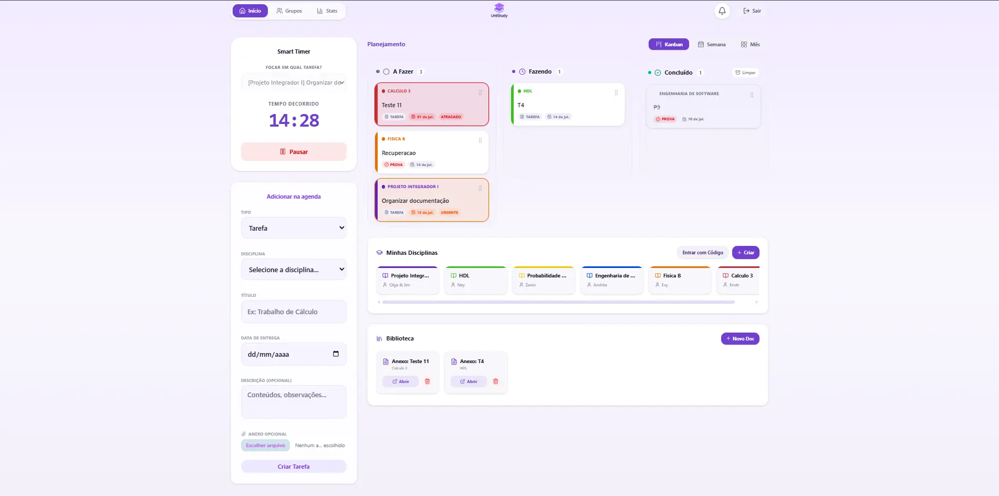

# UniStudy

**Ecossistema Integrado de Produtividade Acadêmica** — plataforma web full-stack desenvolvida para ajudar estudantes universitários a organizar disciplinas, tarefas, materiais de estudo e grupos colaborativos em um único lugar.



**Equipe:** Daiana, Emanuela e Isadora — Engenharia de Projeto Integrador

**Deploy:** 100% em nuvem (Microsoft Azure) — [App Service (`unistudy`)](https://blue-flower-03f9edf0f.7.azurestaticapps.net)

---

## O Problema

O UniStudy nasceu para combater os desafios enfrentados por estudantes no ambiente digital:

- **Fragmentação exaustiva** — horas perdidas alternando entre ferramentas como WhatsApp, Google Drive e Trello
- **Custo de contexto** — esforço mental desperdiçado na troca constante de ferramentas, que quebra a concentração
- **Invisibilidade do esforço** — dificuldade em mensurar o tempo real dedicado aos estudos extraclasse

## Funcionalidades

- **Autenticação & Cadastro** — login com JWT, senhas criptografadas com Bcrypt
- **Disciplinas (Matérias)** — criação, edição, código de convite para colegas entrarem
- **Planner Kanban** — gestão visual *drag and drop* de tarefas com prioridade, prazo, anexos e status
- **Biblioteca** — upload e centralização de materiais (PDFs e imagens) vinculados às disciplinas
- **Smart Timer** — cronômetro de estudo vinculado a tarefas, registra sessões no banco
- **Grupos de Estudo** — criação/entrada por código + senha, ranking de horas por membro
- **Notificações** — pedidos de entrada em disciplina/grupo + sugestoes de tarefas/prova da disciplina
- **Analytics** — KPIs de tarefas concluídas, horas por disciplina, volume de entregas semanais

## Stack

| Camada | Tecnologias |
|---|---|
| Frontend | React, Vite, TailwindCSS, Recharts |
| Backend | Node.js, Express |
| Banco de Dados | PostgreSQL |
| Infraestrutura | Microsoft Azure (App Service + Static Web App + PostgreSQL Flexível), GitHub Actions (CI/CD) |

## Estrutura do repositório

```
sistema-de-produtividade-academica/
├── unistudy-backend/      # API REST (Node.js + Express) — ver README próprio
├── unistudy-frontend/     # SPA (React + Vite) — ver README próprio
├── docs/                  # Documentação técnica do sistema
└── .github/workflows/     # Pipelines de deploy (Azure)
```

## Arquitetura

Cliente-Servidor desacoplado (API REST), sem uso de um framework MVC — o backend é uma API stateless consumida por uma SPA React. Detalhes completos em docs/arquitetura.md.

## Como rodar localmente

Guia completo em [docs/instalacao.md](docs/instalacao.md). Resumo rápido:

```bash
# Backend
cd unistudy-backend
npm install
npm start

# Frontend (em outro terminal)
cd unistudy-frontend
npm install
npm run dev
```

## Documentação

- [Guia de instalação](docs/instalacao.md)
- [Arquitetura do sistema](docs/arquitetura.md)
- [Documentação da API](docs/api.md)
- [Manual do usuário](docs/manual-usuario.md)

## Desafios enfrentados

- **Automação de build:** configurar o GitHub Actions para compilar e publicar frontend e backend separadamente.
- **CORS:** garantir que apenas o domínio oficial do frontend acesse a API.
- **Azure (camada gratuita):** lidar com cold starts e limites de cota.

## Próximos passos

- Adição de notas
- Integração com IA para sugerir cronogramas de estudo
- Notificações por e-mail para lembretes de prazos
