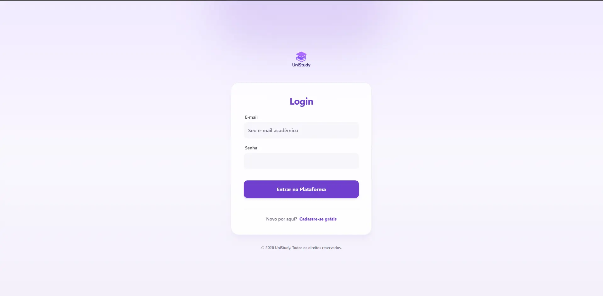
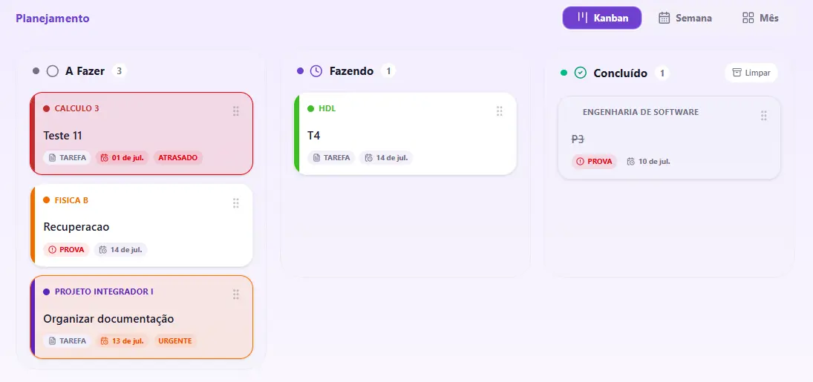
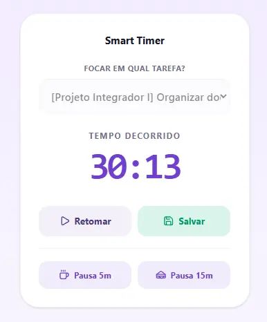
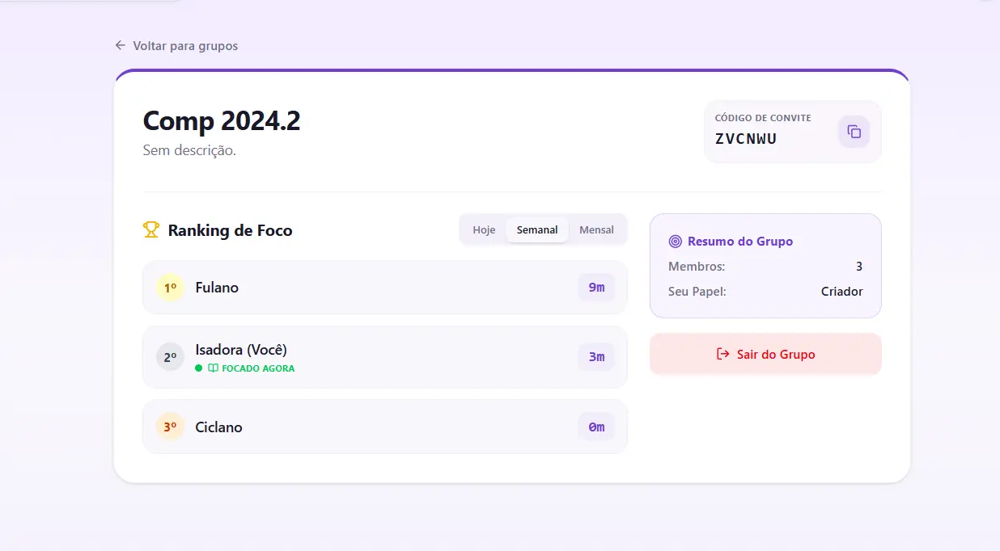
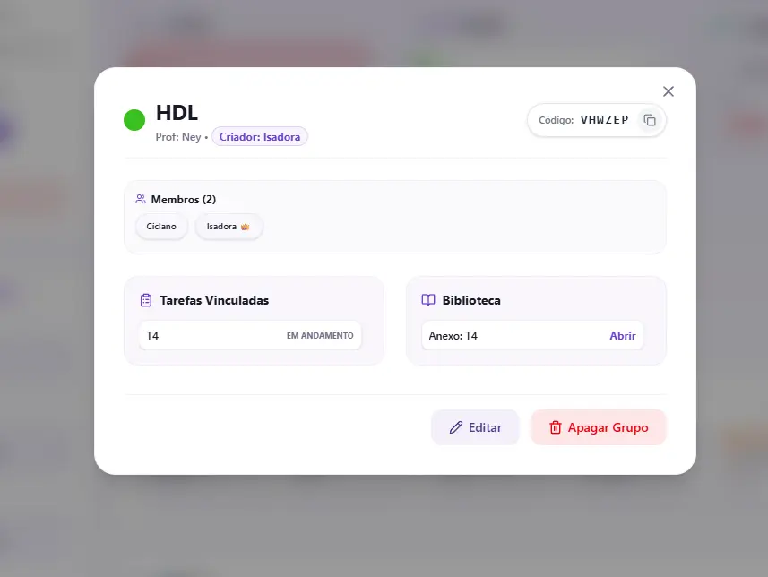
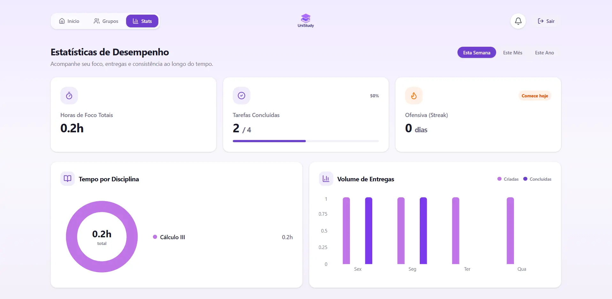
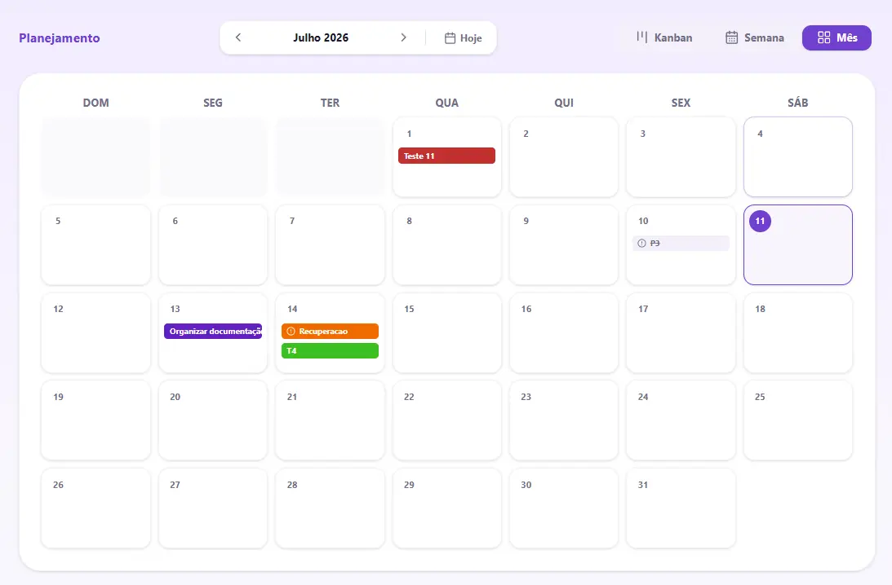
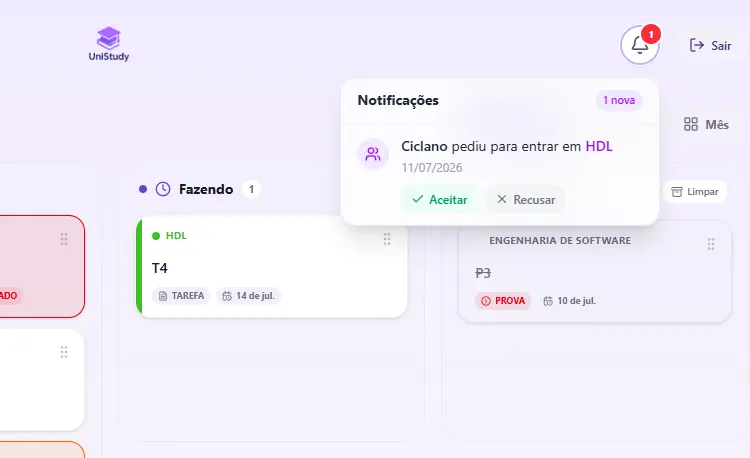
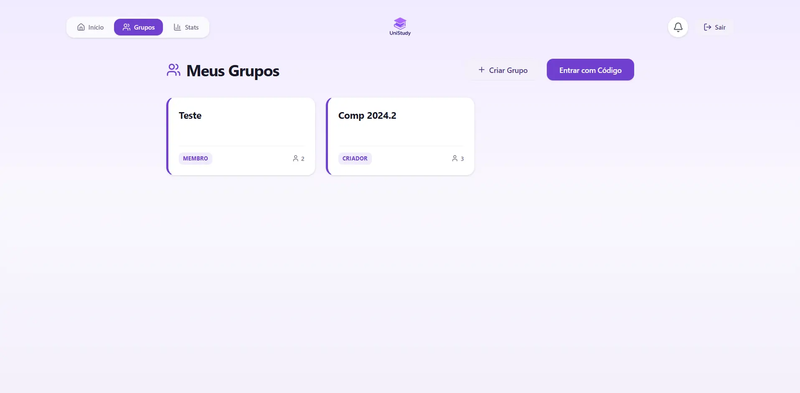

# Manual do Usuário - UniStudy

Este guia apresenta as principais telas e funcionalidades do UniStudy do ponto de vista de quem usa a plataforma.

---

## 1. Login e Cadastro

Novos usuários se cadastram informando nome, e-mail e senha (a senha é armazenada de forma criptografada). Usuários existentes fazem login e recebem um token de sessão válido por 1 hora.

---

## 2. Dashboard Inicial

Ao entrar, o usuário vê um resumo com suas disciplinas, tarefas pendentes e acesso rápido às demais funcionalidades.

---

## 3. Planner Kanban

Cada disciplina tem seu próprio quadro Kanban. As tarefas podem ser criadas com título, prazo, prioridade, descrição e anexo, e movidas entre colunas de status (ex: A Fazer, Em Progresso, Concluída).

---

## 4. Smart Timer

Cronômetro de estudo vinculado a uma tarefa específica. Ao iniciar uma sessão, o tempo é contabilizado e, ao final, registrado no histórico — alimentando as estatísticas de horas estudadas por disciplina.

---

## 5. Grupos de Estudo e Ranking

Usuários podem criar ou entrar em grupos de estudo usando um código de convite e senha. Dentro do grupo, um ranking mostra as horas estudadas por cada membro em um período selecionado.

---

## 6. Disciplinas e Biblioteca de Materiais

Cada disciplina tem um código de compartilhamento para que colegas peçam para entrar (sujeito à aprovação do criador). A biblioteca centraliza os materiais de estudo (PDFs e imagens) enviados para aquela disciplina.

---

## 7. Estatísticas por Disciplina

Painel de analytics com o total de horas estudadas, tarefas concluídas versus total, e a distribuição de horas por disciplina — calculado automaticamente a partir das sessões registradas no Smart Timer.

---

## 8. Visualização em Calendário

Visão de calendário com os prazos de entrega das tarefas cadastradas, útil para planejamento semanal.

---

## 9. Notificações

Central de notificações onde o criador de uma disciplina ou grupo aprova ou recusa pedidos de entrada de outros usuários.

---

## 10. Grupos no Dashboard

Visão consolidada dos grupos de estudo do usuário diretamente no dashboard principal.
