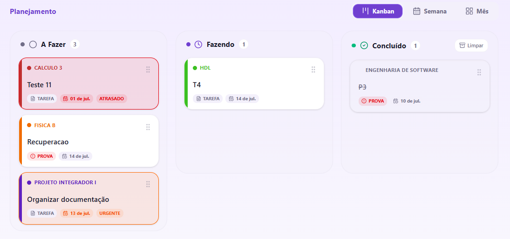
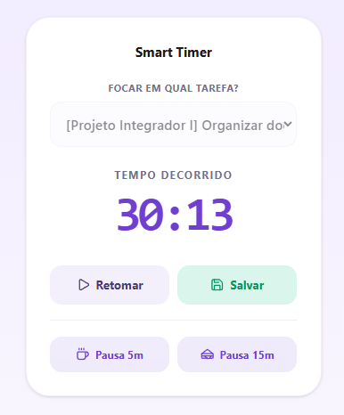

# UniStudy - Interface Frontend

SPA (Single Page Application) do UniStudy, desenvolvida em React. Consome a API REST do backend para autenticação, disciplinas, tarefas, timer de estudo, grupos e analytics.

---

## Tecnologias Utilizadas

- **Framework Principal:** React (com Vite)
- **Estilização:** Tailwind CSS
- **Gráficos:** Recharts
- **Padrão de UI:** componentes base gerados com apoio da IA v0 (Vercel) para manter consistência visual

---

## Componentes Visuais

Aqui estão as principais ferramentas renderizadas pela SPA:

### 📋 Gestão de Tarefas (Kanban)

*Local:* `src/components/TaskForm.jsx` e painel principal.
Permite o fluxo de trabalho visual de tarefas através de colunas de status.

### ⏱️ Smart Timer e Foco

*Local:* `src/components/SmartTimer.jsx` (Estado mantido por `src/contexts/TimerContext.jsx`).
Rastreia horas líquidas e envia o log de tempo para o banco de dados.

### 🏆 Gamificação e Grupos

*Local:* `src/components/Grupos.jsx`.
Exibe o Leaderboard de membros e o indicativo de estudo em tempo real.

---

## Estrutura de Pastas Interna

- `src/pages/` — páginas principais: `Login.jsx` (autenticação) e `Dashboard.jsx` (aplicação principal, após login).
- `src/components/` — componentes de funcionalidade: `SubjectList.jsx` (disciplinas), `TaskForm.jsx` (Kanban), `SmartTimer.jsx` (cronômetro de estudo), `Library.jsx` (materiais), `Grupos.jsx` (grupos de estudo), `StudyAnalytics.jsx` (estatísticas), `Notification.jsx` (notificações).
- `src/components/ui/` — componentes de UI reutilizáveis (base shadcn/ui).
- `src/contexts/TimerContext.jsx` — contexto React que mantém o estado global do Smart Timer entre páginas.
- `src/assets/` — imagens e ícones estáticos.

## Variáveis de Ambiente

- `.env.production` — usada no build de produção (aponta para a API publicada no Azure).
- Em desenvolvimento local, a API é acessada em `http://localhost:5173` → `http://localhost:3000` (já liberado no CORS do backend).

## Como Executar este Módulo Individualmente

```bash
# Instalar as dependências
npm install

# Iniciar o servidor de desenvolvimento local
npm run dev
```

A aplicação sobe por padrão em `http://localhost:5173`.
